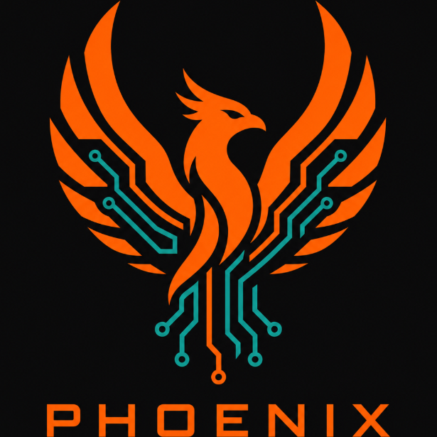

<p align="center">
  
</p>

# Phoenix — MonoCode V4

This work-in-progress checkout includes the MonoCode V4 desktop frontend and its native Phoenix runtime. The MonoCode launcher is the default app entry point.

Phoenix is a local-first whole-computer agent runtime written in Rust. You give it work in plain language and a persistent company of named coworkers operates across your repo, terminal, browser, desktop, connected apps, databases, and files.

One runtime. Phoenix and a persistent team of coworkers. Each has one endless conversation, durable memory, a private browser profile, and access to the complete tool catalog. Groups let several coworkers discuss and execute together without erasing their individual history.

## What it is

The gateway daemon owns sessions and durable work, every tool output passes through a compression layer before model context, and providers that support server-side conversation state avoid resending the complete transcript every round.

It has memory that actually works — knowledge graph, session digests, recall across sessions. Goals with cron triggers for autonomous scheduled execution. Managed Chromium browser automation with private coworker profiles. Autonomous coding loops that plan, build, test, verify. Composio connections for Gmail, GitHub, Slack, Notion, and more.

A new company starts with five coworkers. Additional built-in roles and custom coworkers can be created as needed; existing installations retain their saved names, roles, and history.

| Coworker | Responsibility |
|----------|----------------|
| Phoenix | coordination, delegation, and cross-domain work |
| Leo | engineering and technical delivery |
| Iris | product design and frontend execution |
| Theo | research and primary evidence |
| Remy | reliability, security, and verification |

## Getting started

Requirements: Linux, Rust stable, Node.js 22 or newer, Python 3, and the GTK/WebKit development dependencies needed by Tauri. The runtime builds native database dependencies, so a C/C++ toolchain and CMake are also required. Chrome/Chromium enables coworker browser profiles.

```bash
cargo build --release --bin phoenix
(cd canvas-app && cargo build --release)
(cd canvas-app/chromium-shell && npm ci)
./target/release/phoenix onboard  # first-time provider/model setup
./run.sh                       # open Phoenix MonoCode V4
```

Debug builds work too. If you use a custom Cargo target directory, pass `./run.sh --gateway /path/to/phoenix --desktop /path/to/phoenix-desktop`. The launcher serves the bundled MonoCode frontend on loopback port 47845 and connects it to the native services. It reads your existing local Phoenix account; account state is not included in this repository.

Room polish includes first-name mentions, coworker replies in the room transcript, an answer arrow that opens the work trace, a compact sidebar logo, and a browser ownership chip.

Agent desktops automatically use a private GNOME compositor and Phoenix cursor when
`gnome-shell`, `dbus-run-session`, and `gdbus` are available. If native startup fails,
Phoenix falls back to a private X11 desktop. Set `PHOENIX_DESKTOP_BACKEND=gnome` to
require GNOME, or `PHOENIX_DESKTOP_BACKEND=x11` to select the fallback explicitly.
`auto` is the default. The existing visible-Xephyr opt-in selects X11 in auto mode.
Each backend runs separately from the user's desktop; the Desktop tab shows the
agent's latest observation.

## Layout

| Path | What it is |
|------|-----------|
| `src/` | the runtime: CLI/TUI, mesh, tools, providers |
| `prompts/` | system prompts (synced to ~/.phoenix/prompts) |
| `vendor/` | vendored memory, browser, and TasteCode design runtime dependencies |
| `desktop/` | GNOME helpers (AT-SPI bridge, shell extension) |
| `canvas-app/` | native desktop services and Chromium/Electron shell |
| `monocode/` | MonoCode V4 frontend, pinned character assets, and source launcher |
| `tests/` | integration tests |
| `scripts/` | runtime helpers and verification scripts |
| `examples/` | standalone runtime examples and diagnostics |

## Group conversation contract

Groups extend the existing canonical conversation and company event stores; they are not a second chat system. New and edited groups contain 2–6 currently active coworkers. Names are generated from the authoritative roster when omitted and remain editable. A room message wakes nobody unless it names stable coworker IDs; one or several mentions wake exactly those coworkers. `@everyone` first resolves and displays the complete current roster, requires confirmation, and carries a roster fingerprint through the durable turn queue. The gateway rejects a stale or substituted activation before execution.

Each coworker keeps a private browser profile, credentials, direct conversation, permission grants, and private memory. A group participant receives the canonical group transcript plus their permitted personal/team memory; the project-brain digest of other same-workspace sessions is deliberately excluded from group prompts. Removing a member changes future activation only and leaves the canonical room history intact. Legacy groups above the new six-member creation limit remain readable and may be reduced without silently rewriting history.

The disabled group settings seams are `routing_mode` (production accepts `mentions_only`), `structured_handoffs`, `visible_execution_queues`, `group_templates`, and `granular_retention`. Enabling any unfinished seam is rejected so the default behavior cannot silently change.

The desktop and daemon share `~/.phoenix/workspace` as their default working directory. Workspace permission confines relative and absolute access to that root; Full Access may operate outside it. An explicit CLI or folder-picker workspace still wins for that turn and is remembered by later wakes.

## Desktop shell

Run `./run.sh` from this checkout to open MonoCode V4. The native desktop host launches the Electron shell with the MonoCode frontend URL and the gateway binary built from this source. The bundled pinned character assets are served locally.

Iris's design package is vendored with its source, reference library, and integrity manifest; see [docs/iris-design.md](docs/iris-design.md) for installation and verification.

MonoCode rooms include a configurable leader, coworker avatars, and messages delivered while work is running. All coworkers have the bundled motion graphics workflow; see [docs/motion-graphics.md](docs/motion-graphics.md) for its actions and media dependencies.

Settings → Passes manages encrypted logins, cards, and keys. Coworkers can request and use passes through typed tools; see [docs/passes.md](docs/passes.md). Closing the desktop window hides Phoenix to the tray, where **Quit Phoenix** stops the runtime.

## Cross-platform

Linux is the current release target. The core runtime and Tauri UI are structured for Windows and macOS ports; native desktop control, notification delivery, process supervision, and credential integration have platform-specific implementations.

## License

**License:** This project is source-available under the PolyForm Strict License 1.0.0. You may view, run, and modify the code locally for personal, educational, or research purposes. You may NOT copy, distribute, fork, or create derivative works. See [LICENSE](LICENSE) for full terms.

## Tests

The test suite covers the gateway, mesh, company directory, canonical conversations, groups, tools, browser automation, memory, workflows, approvals, security, and compression. Run it with `cargo test`.

The room routing regression tests run with `cargo test --lib authored_room`. The MonoCode browser regression test runs with `node tests/monocode-room-polish.cjs`; it uses an isolated headless Chrome profile and fixture state. Set `CHROME_BINARY` to your Chromium executable if it is not `google-chrome-stable`.

This repository contains maintained source and reusable test inputs. Coworker conversations, credentials, browser profiles, generated reports, and personal deliverables belong in local runtime/workspace storage.
